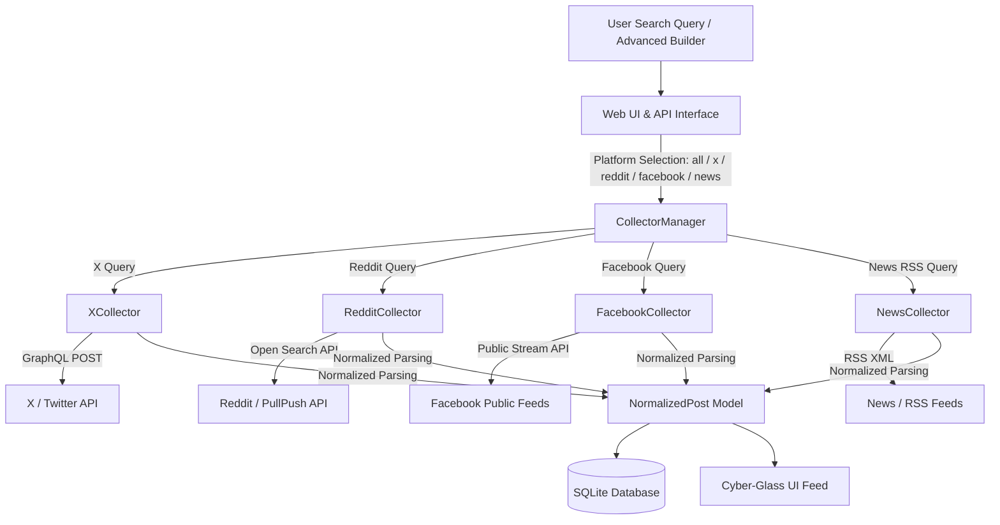

# Social Media Monitoring - Project Documentation

This documentation provides an overview of the core X (Twitter) monitoring prototype designed and built for the Social Media Monitoring internship project.

---

## 1. Completed Milestones (Phase 1)

We have successfully established the foundational architecture and verified keyword search operations:

- **Decoupled Architecture**: Designed a modular pipeline where data collection, data normalization, database storage, and user displays are completely isolated.
- **Unified Normalized Schema**: Implemented the [`NormalizedPost`](file:///e:/AiTEC%20Internship%20'26/Social%20Media%20Monitoring/app/models/post.py) model using Pydantic, standardizing all key tweet details (author display names, usernames, creation dates, metrics, views, and links) across platforms.
- **Resilient X Collector**: Implemented [`XCollector`](file:///e:/AiTEC%20Internship%20'26/Social%20Media%20Monitoring/app/collectors/x_collector.py) wrapping `twscrape`. Built safety guards to catch empty configurations, expired cookies, and rate limits.
- **SQLite Database Integration**: Structured [`Database`](file:///e:/AiTEC%20Internship%20'26/Social%20Media%20Monitoring/app/database/db.py) to save posts (ignoring duplicates by ID) and log history.
- **CLI & Web Dashboards**: Built an interactive terminal CLI (`run_cli.py`) and a FastAPI-based browser dashboard (`run_web.py`) with presets for quick searches.
- **Robust Test Suite**: Programmed 7 automated tests verifying data transformation, DB constraints, and collectors.

---

## 2. Completed Milestones (Phase 2 - Advanced Search Queries)

We expanded the prototype with full support for advanced search syntax, boolean logic, and an interactive query builder:

- **Structured Query Builder & Validator**: Created [`QueryBuilder`](file:///d:/AiTeC%20Internship%20'26/TrendChecker%20-%20SSM%20/social-media-monitoring/app/utils/query_builder.py) and [`SearchQueryFilter`](file:///d:/AiTeC%20Internship%20'26/TrendChecker%20-%20SSM/social-media-monitoring/app/utils/query_builder.py) supporting `AND`, `OR`, `NOT` (`-`), exact phrase `"..."`, `from:`, `to:`, `@mentions`, `lang:`, `since:`, `until:`, `min_faves:`, `min_retweets:`, `filter:media`, `filter:links`, and `-filter:replies`.
- **FastAPI Endpoints**: Exposed `/api/query/build` and `/api/query/validate` for query compilation and syntax diagnostics.
- **Interactive Web UI Query Builder**: Built a dedicated modal on the Web Dashboard for visual filter configuration, live query previews, clipboard copying, and instant search application.
- **Quick Syntax Chips**: Added one-click tokens (`+ OR`, `+ lang:en`, `+ from:`, `+ min_faves:10`, `+ filter:media`) for instant inline search query refinement.
- **Expanded Test Suite**: Extended automated unit tests to 18 passing test cases across collectors, models, databases, and query builders.

## 3. Completed Milestones (Phase 3 - Multi-Platform Expansion & Cyber-Glass UI)

We expanded the platform from X-only into a **full multi-platform social & news intelligence engine** with a **modern tech-aesthetic UI**:

- **🔵 Facebook Public Post Collector**: Implemented [`FacebookCollector`](file:///d:/AiTeC%20Internship%20'26/TrendChecker%20-%20SSM/social-media-monitoring/app/collectors/facebook_collector.py) indexing public Facebook posts, university official pages (`facebook.com/iiui.isb`, `facebook.com/nustofficial`), and community discussions without requiring Facebook tokens or cookies.
- **🔴 Reddit Search Collector**: Implemented [`RedditCollector`](file:///d:/AiTeC%20Internship%20'26/TrendChecker%20-%20SSM/social-media-monitoring/app/collectors/reddit_collector.py) fetching public Reddit discussions, community threads, scores, and comment counts across university subreddits (`r/islamabad`, `r/pkmigrate`, `r/Comsats`, `r/NUST`).
- **📰 News & RSS Collector**: Implemented [`NewsCollector`](file:///d:/AiTeC%20Internship%20'26/TrendChecker%20-%20SSM/social-media-monitoring/app/collectors/news_collector.py) parsing Google News RSS and media feeds into unified normalized articles with source attribution.
- **🌐 Unified Multi-Platform Manager**: Implemented [`CollectorManager`](file:///d:/AiTeC%20Internship%20'26/TrendChecker%20-%20SSM/social-media-monitoring/app/collectors/manager.py) to search individual platforms or run concurrent multi-platform searches (`"all"`), merging results chronologically.
- **✨ Cyber-Glass Tech UI/UX Redesign**: Redesigned the entire web dashboard with deep space dark styling (`#060913`), frosted glass cards (`#0c1322`), neon glows, pulsating radar status ping, live platform breakdown pill counters, and `Ctrl+K` keyboard navigation.
- **Comprehensive Unit Testing**: Expanded test suite to **22 passing automated tests**.

---

## 4. Architecture & Data Flow

---

## 5. Account Pool & Authentication
- **Multi-Platform Auth Strategy**:
  - **X (Twitter)**: Authenticated via browser session cookies (`auth_token` + `ct0`) managed in `data/accounts.db`.
  - **Reddit & News/RSS**: Public open access with zero login credentials required.
- **Data Security**: All databases and credentials are kept in the `data/` folder, completely ignored by `.gitignore` to prevent leaks.

---

## 6. Proposed Next Steps

### Phase 4: AI & Topic Processing
- Implement a lightweight local AI processor (e.g., using `transformers` or small offline libraries) for:
  - Sentiment analysis (Positive, Neutral, Negative)
  - Topic classification (Academics, Admissions, Sports, Complaints, News)

### Phase 5: Automation & Scheduling
- Implement a background scheduler (using `APScheduler` or built-in asyncio timers) to automatically fetch matching posts for registered keywords every hour and update the database silently.

