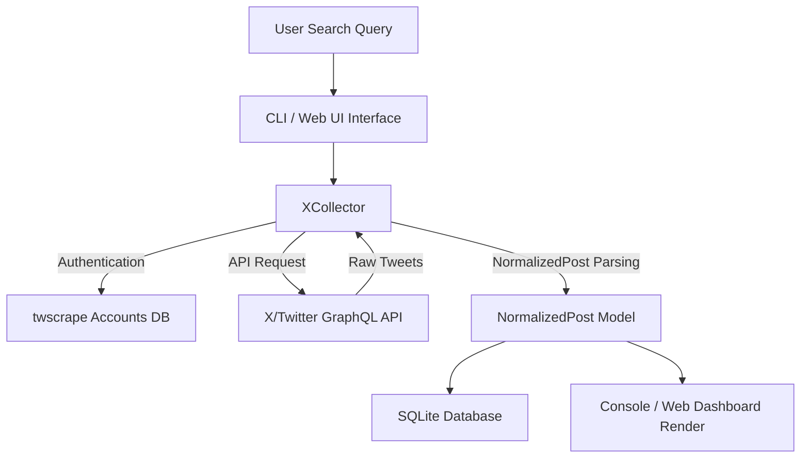

# Social Media Monitoring - Project Documentation

This documentation provides an overview of the core X (Twitter) monitoring prototype designed and built for the Social Media Monitoring internship project.

---

## 1. Completed Milestones (Phase 1)

We have successfully established the foundational architecture and verified keyword search operations:

- **Decoupled Architecture**: Designed a modular pipeline where data collection, data normalization, database storage, and user displays are completely isolated.
- **Unified Normalized Schema**: Implemented the [`NormalizedPost`](file:///e:/AiTEC%20Internship%20'26/Social%20Media%20Monitoring/app/models/post.py) model using Pydantic, standardizing all key tweet details (author display names, usernames, creation dates, metrics, views, and links) across platforms.
- **Resilient X Collector**: Implemented [`XCollector`](file:///e:/AiTEC%20Internship%20'26/Social%20Media%20Monitoring/app/collectors/x_collector.py) wrapping `twscrape`. Built safety guards to catch empty configurations, expired cookies, and rate limits.
- **SQLite Database Integration**: Structured [`Database`](file:///e:/AiTEC%20Internship%20'26/Social%20Media%20Monitoring/app/database/db.py) to save posts (ignoring duplicates by ID) and log history.
- **CLI & Web Dashboards**: Built an interactive terminal CLI (`run_cli.py`) and a FastAPI-based browser dashboard (`run_web.py`) with presets for quick searches.
- **Robust Test Suite**: Programmed 7 automated tests verifying data transformation, DB constraints, and collectors.

---

## 2. Architecture & Data Flow

---

## 3. Account Pool & Authentication
- **Session-Based Authentication**: X's search endpoint requires a logged-in session. Instead of username/password authentication which prompts 2FA or CAPTCHAs, the prototype uses browser cookies (`auth_token` and `ct0`).
- **Data Security**: All databases and credentials are kept in the `data/` folder, which is completely ignored by `.gitignore` to prevent leaks to public repositories.

---

## 4. Proposed Next Steps

### Phase 2: Advanced Search Queries
- Parse advanced queries (e.g. `IIUI OR COMSATS`, `IIUI lang:en`).
- Build a query validator / helper inside the search cards.

### Phase 3: Broadening Platforms
- Inherit from [`BaseCollector`](file:///e:/AiTEC%20Internship%20'26/Social%20Media%20Monitoring/app/collectors/base.py) to implement new search collectors (e.g. Reddit, RSS feeds, Web Scrapers).

### Phase 4: AI & Topic Processing
- Implement a lightweight local AI processor (e.g., using `transformers` or small offline libraries) for:
  - Sentiment analysis (Positive, Neutral, Negative)
  - Topic classification (Academics, Admissions, Sports, Complaints, News)

### Phase 5: Automation & Scheduling
- Implement a background scheduler (using `APScheduler` or built-in asyncio timers) to automatically fetch matching posts for registered keywords every hour and update the database silently.
